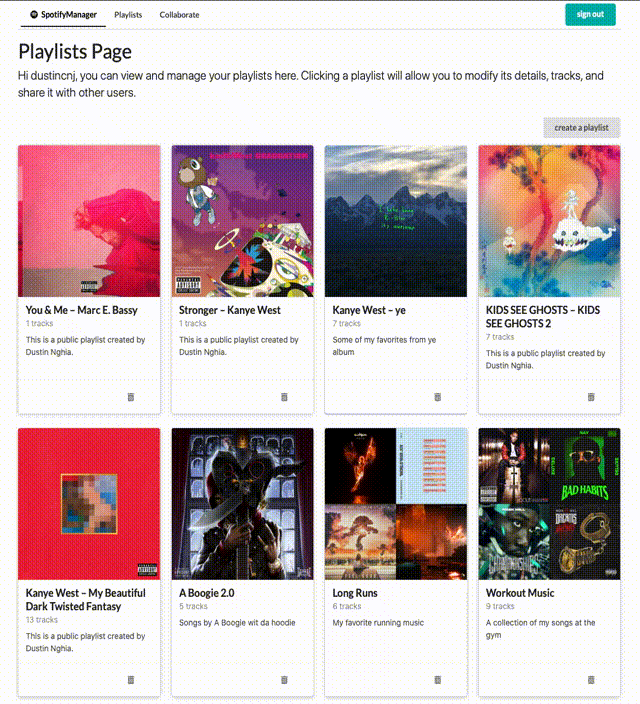
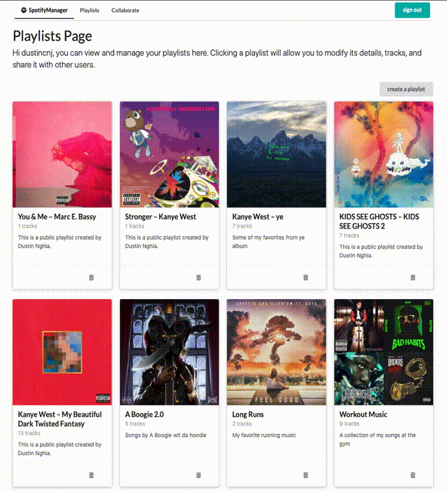
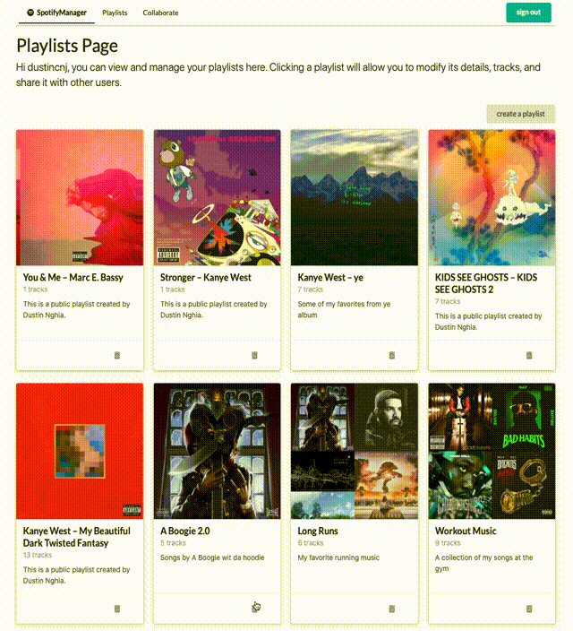
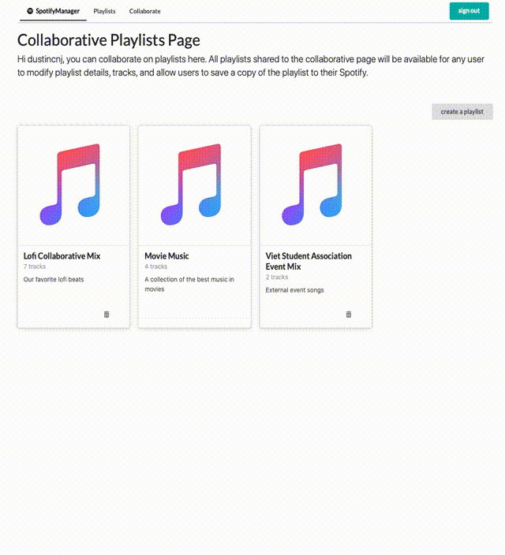

# [SpotifyManager](https://spotifymanagerapp.herokuapp.com/):musical_note:

SpotifyManager is a full stack MERN web application that uses the Spotify API to allow Spotify Users to to modify and manage their playlists and to also share their playlists with other users to allow for easy collaboration (multiple users modifying a single playlist). It supports the following use cases:
* Spotify User Authentication (OAuth 2.0)
* creating a playlist
* editing a playlist's details
* deleting a playlist
* sharing a playlist to allow other users of the site to collaborate
* dynamic track searching
* adding tracks to a playlist
* deleting tracks from a playlist
* saving collaborative playlists 

:exclamation: This repo contains the front-end code only, the back-end express REST API server repo can be found here: [Back-End Express REST API](https://github.com/dustincheung/SpotifyManagerBackend):exclamation:

The front-end and back-end are hosted on Heroku seperately.

## Getting Started:white_check_mark:

[SpotifyManager is deployed on Heroku here](https://spotifymanagerapp.herokuapp.com/)

Click the link and sign into Spotify (if you do not have a Spotify account I demo the functionality below). After signing in you will see your playlist page populated with your Spotify playlists.  

Clicking the trash icon will delete the playlist and clicking on a playlist will load the playlist details page. The playlist details page will allow you to edit details on a playlist and add/remove tracks.  

You can even share a playlist to allow for collaboration.  Sharing a playlist will put the playlist to the collaborative playlists page which can be navigated to using the menu bar. This will allow all users on the site to collaborate on this playlist (edit details, add/remove tracks) and ultimately save a copy of the playlist for themselves.

## App Demo:apple:
### Spotify OAuth:

### Creating/deleting/editing a playlist:

### Adding/removing tracks from a playlist (dynamic search feature):

### Sharing a playlist to allow for collaboration:

### Modifying a collaborative playlist and saving:

## Built With:hammer:
### Front-End:
* [HTML5] - Hypertext Markup Language
* [CSS3] - Cascading Style Sheets
* [React.js](https://reactjs.org) - JavaScript front-end library using components to build user interfaces
* [React-Redux.js](https://reactjs.org) - Predictable state container for JavaScript apps
* [Semantic UI](https://semantic-ui.com) - CSS framework

### Back-End:
* [Node.js](https://nodejs.org/en/) - JavaScript runtime environment that executes JavaScript server side 
* [Express.js](https://expressjs.com) - Lightweight Node.js web application server framework
* [MongoDB](https://reactjs.org) - Document-based NoSQL database

### Significant NPM Packages (Front-End & Back-End):
* [Spotify-web-api-js](https://www.npmjs.com/package/spotify-web-api-js) - lightweight wrapper for the Spotify Web API
* [Body-parser](https://www.npmjs.com/package/body-parser) - Request body parsing middleware
* [Dotenv](https://www.npmjs.com/package/dotenv) - Module that loads env variables from .env file
* [Axios](https://www.npmjs.com/package/axios) - Promise based HTTP client for the browser and node.js
* [React-router-dom](https://www.npmjs.com/package/react-router-dom) - DOM bindings for React Router
* [Redux-form](https://www.npmjs.com/package/redux-form) - Works with React Redux to enable an html form in React to use Redux to store all of its state
* [Redux-thunk](https://www.npmjs.com/package/redux-thunk) - Middleware for Redux that allows action creators to return async functions, useful for network requests

## Deployment:computer:

* [SpotifyManager is deployed on Heroku here](https://spotifymanagerapp.herokuapp.com/)
* [SpotifyManager back-end REST API server is deployed on Heroku here](https://spotifymanager.herokuapp.com/)

## Authors:pencil2:

* **Dustin Cheung** - [dustincheung](https://github.com/dustincheung)